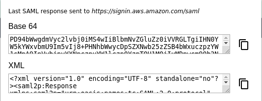

# Chrome SAML

See the most recent SAML response in the browser.

This is useful for other programs requiring SAML responses.

<p align="center">
  
</p>

For example, the AWS CLI:

```txt
aws sts assume-role-with-saml \
    --role-arn arn:aws:iam::000000000000:role/Admin \
    --principal-arn arn:aws:iam::000000000000:saml-provider/Google \
    --saml-assertion <base64_saml_response>
```

## Install

Download ZIP from [Releases](https://github.com/rivethealth/chrome-saml/releases), and add to Chrome extensions. (Developer mode may be required.)

Chrome Webstore listing is currently under review.

## Usage

1. Perform your normal SAML login via Chrome.

2. Click on the key icon in the upper right.

3. Copy the base64 encoded or raw SAML response.

## Full example: Google + AWS

1. Add browser bookmark for Google-initiated login, e.g.
   https://accounts.google.com/o/saml2/initsso?idpid=A0000000&spid=000000000000&forceauthn=false

2. Download [`example/aws-auth.py`](example/aws-auth.py). Run `aws-auth.py --help` to list options. 

Authenticate AWS CLI by clicking on bookmark, copying SAML response, and running
script.
